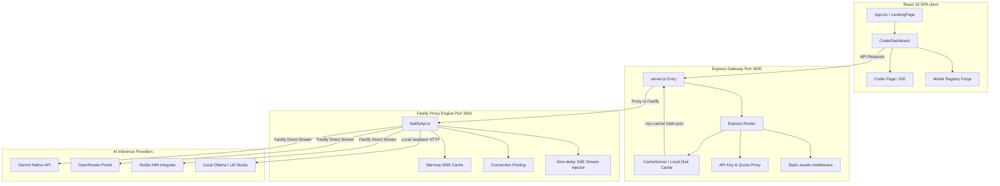

# 🌌 NYX — Premium AI Coder Playground & Agent Runner

[](https://vite.dev)
[](https://react.dev)
[](https://fastify.dev)
[](https://tailwindcss.com)

**NYX** is a state-of-the-art, high-fidelity developer playground designed for advanced code generation and interactive running of AI agents, featuring direct proxy routing, unified caching, and a robust model registry. Designed around a "clinical-modern" user interface, it provides millisecond-level responsive streaming, modular IDE controls, and secure local API key credential handling.

---

## 🚀 What's New in NYX 2.0

### 🤖 Multi-Agent Pipeline (NYX Agent)
The NYX agent now runs a **3-stage sequential pipeline** internally, delivering elite-quality output:

| Stage | Agent | Role |
|---|---|---|
| 1 | **Architect Agent** | Designs the system blueprint & architecture |
| 2 | **Coder Agent** | Implements complete production code from the blueprint |
| 3 | **Optimizer Agent** | Audits, refines, and delivers the final answer |

During stages 1 & 2 a compact progress banner is shown. **The final output is only the Optimizer's clean, complete response** — no intermediate stages are exposed to the user.

### ✨ Key Improvements
- **Clean Final Output** — No Stage 1/Stage 2/Stage 3 labels in the response. You get complete code + a `## How to Use` section, every time.
- **Never-Truncated Code** — All pipeline stages now use **16,384 max tokens** (up from 4,096), so even large HTML/CSS/JS files are always output in full.
- **Syntax-Highlighted Code Blocks** — Responses render rich Markdown with dark-themed, language-aware syntax highlighting (powered by `react-syntax-highlighter`).
- **"Select Model" Placeholder** — The model selector no longer pre-selects a default. It shows an amber **"Select Model"** prompt until you choose a model. The Run button is disabled until a model is selected.
- **Real-Time Latency & TPS** — The header shows live elapsed time (switching between `ms` and `s` dynamically) and token-per-second throughput updated in real time during generation.
- **Provider-Aware Routing** — Uses your selected model's provider for API key resolution. No more false "Anthropic API error" when using Gemini models.

---


## 🛠️ System Architecture

NYX uses a highly optimized dual-server architecture that leverages the modularity of **Express** alongside the extreme streaming throughput of **Fastify**. This ensures zero-overhead EventSource (SSE) flushing, persistent TCP connection keep-alives, and automatic fallback capabilities.



## ✨ Core Pillars & Features

### 1. 💻 Coder Mode IDE Workspace
- Full-screen coder interface supporting multiline editor windows, contextual prompts, and variable LLM settings.
- Structured code execution and live session-level audits.

### 2. 🎛️ Model Registry & Forge
- Clean, searchable model registry dashboard displaying capabilities, cost ratios, and latency status.
- Support for **Local Models** via automatic host loopback discovery (Ollama and LM Studio).
- Instant switching and state persistence.

### 3. ⚡ Streaming Optimization Engine (Fastify & Express)
- **Fastify Router Bridging**: SSE streams bypass Express compression bottlenecks, utilizing Fastify's zero-copy write loops for instant data flushing.
- **Nagle's Algorithm Disabling**: TCP sockets are initialized with `setNoDelay(true)`, eliminating the 40ms network buffering delay.
- **DNS Lookup Warmup**: Background lookups to Cloudflare DNS (`1.1.1.1` and `8.8.8.8`) bypass Windows local host resolver latency.
- **Connection Keep-Alives**: Persistent sockets stay active for 75 seconds, eliminating HTTPS handshakes on consecutive prompts.

### 4. 💾 Ultra-Fast Local Disk Caching
- Key generation compiles the request structure (provider, model, prompt, system prompt, conversation history, settings) into a unique **SHA-256 hash**.
- High-efficiency disk cache residing under the `.nyx-cache/` directory.
- Features complete stats tracking (hits, misses, storage size, itemized logs) and single-click flushing.

### 5. 🔑 Unified Settings & API Key Manager
- **Secure Local Storage**: Custom provider API keys are saved directly in your browser's secure `localStorage`. They are never stored on any remote database or sent to third-party tracking systems.
- **Dynamic Quota Discovery**: Instantly verify your remaining quota (USD credits or token limit) directly inside the Settings tab for connected API providers (e.g. OpenRouter, Google Gemini).
- **Custom Gateways**: Configure custom gateway URLs for each provider to route requests via alternate endpoints or self-hosted API gateways.

---

## 📂 Codebase Directory Structure

```yaml
NYX/
├── .agents/                 # Automated agents, configurations, and scripts
├── .nyx-cache/              # Local SHA-256 disk cache directory
├── server/                  # Backend Node.js source files
│   ├── lib/
│   │   ├── apiAgent.ts      # Global connection pooling configurations
│   │   ├── cache.ts         # High-efficiency prompt caching mechanism
│   │   ├── fastifyApi.ts    # Fastify stream assembler & DNS warmup engine
│   │   └── gateway.ts       # Route proxy controllers
│   └── routes/              # Specialized API router files (Gemini, Nvidia, OpenRouter, Ollama)
├── src/                     # React 19 SPA source files
│   ├── components/          # Reusable presentation and layout components
│   │   ├── dashboard/       # ModelRegistryView, SettingsView
│   │   ├── landing/         # AppPreview, LiveTerminal, WebGLShader
│   │   ├── ui/              # Atom-level layout buttons, tooltips, and icons
│   │   ├── CoderDashboard.tsx # Global layout and state coordinator
│   │   └── LandingPage.tsx  # Clinical-modern welcome hub & animation sequence
│   ├── config/              # Model listings, system configurations, agent catalogs
│   ├── context/             # Global contexts (e.g. ThemeContext)
│   ├── features/            # Coder features & related IDE view blocks
│   ├── hooks/               # Core state machinery hooks (useDashboardState, etc.)
│   ├── lib/                 # State sync helpers, stream parsers, client tools
│   ├── types/               # Type files for model, grid, column structure
│   ├── App.tsx              # Root React element with authentication gateway
│   ├── index.css            # Base visual system tokens (light/dark modes)
│   └── main.tsx             # DOM entry point
├── server.ts                # Application entry point (dual Express & Fastify assembler)
├── vite.config.ts           # Bundler config & Tailwind vite configurations
└── tsconfig.json            # Strict TypeScript settings
```

---

## 🚦 Getting Started & Local Setup

### Prerequisites
- **Node.js** v18 or newer
- **Local AI Engines** (Optional): Ollama or LM Studio running locally

### Installation & Launch

1. **Clone the repository and install packages**:
   ```bash
   npm install
   ```

2. **Setup Local API Keys**:
   Create a `.env.local` or copy values into the client dashboard's Settings tab:
   ```env
   GEMINI_API_KEY=your_gemini_api_key_here
   OPENROUTER_API_KEY=your_openrouter_api_key_here
   NVIDIA_API_KEY=your_nvidia_api_key_here
   ```

3. **Spin up the Dual Server**:
   ```bash
   npm run dev
   ```
   This runs `tsx watch server.ts` which fires up the Express Gateway on port `3000` and Fastify engine on port `3001`.

4. **Access the Playground**:
   Navigate to [http://localhost:3000](http://localhost:3000) on your web browser to enter NYX!

---

## 💎 Design System & Aesthetic Tokens

NYX uses a design system tailored around **clinical-modern** visuals. Details are defined within `DESIGN.md`. Key design properties:
- **Cream Light Theme**: Dominant premium warm background (`#FCF9F2`), deep geometric gray fonts (`#1D1D1F`), and clean card surfaces (`#FFFFFF`).
- **Clinical Dark Theme**: Elevated charcoal backdrop (`#3A3A3C`), sharp cards (`#48484A`), and ultra-legible headers (`#FFFFFF`).
- **Signature Apple Accents**: Primary interactive highlights powered by Apple System Blue (`#0071E3` light / `#0A84FF` dark).
- **Subtle Spring Easing**: Framer-motion interactive components utilize spring easings for highly tactile UI responses.

---

## ⚙️ How the Application Works (Request Lifecycle)

NYX’s dual-server layout ensures fast UI responses and streaming proxy connections:

1. **Frontend Dispatch**: When you enter a prompt in the Coder workspace, the React 19 SPA dispatches a request to the backend.
2. **Local SHA-256 Cache Interception**: The request first hits the **Express Gateway** on Port `3000`. Express hashes your prompt, system instructions, model settings, and conversation history into a unique **SHA-256 key**. If a match exists in `.nyx-cache/`, it serves the result instantly—saving rate limits, API quota, and reducing response latency to `0ms`.
3. **High-Performance Stream Proxying**: If the request misses the cache, it is proxied to our lightweight **Fastify Streaming Engine** running on Port `3001`.
4. **Zero-Delay SSE Streams**: Fastify focuses exclusively on low-latency routing. It disables TCP Nagle's algorithm (`setNoDelay(true)`), uses background Cloudflare DNS pre-warming, and routes EventSource chunks back to the frontend with virtually zero buffering.
5. **Secure Local Keys**: Your API keys are saved strictly in your browser's client-side sandbox (`localStorage`). They are only sent to the authentic provider endpoint via the proxy servers and are never persisted on any database.

---

## ⚙️ How to Setup API Keys in the Settings Page

1. **Access Settings**: Click the **Settings** tab in the sidebar navigation inside NYX.
2. **Input Credentials**: Paste your API keys into the corresponding fields for Google Gemini, OpenRouter, NVIDIA NIM, or OpenCode.
3. **Automatic Verification**: As soon as a valid key is input, the Settings page automatically connects to the provider to verify validity, discovers available models, and displays your active quota limit in the UI.
4. **Gateways configuration (Optional)**: Click the **Gateways** button in the header of the Settings page to reveal custom endpoint inputs if you wish to route calls via localized API gateways.

---

## 🎁 How to Get Free Developer API Keys (Step-by-Step Instructions)

Start using NYX at zero cost by obtaining free API keys from the following providers:

### 1. Google Gemini API
Google AI Studio grants generous free tier limits for Google Gemini models (Gemini 1.5 Flash/Pro, Gemini 2.0, Gemini 3.0) for developer prototyping.
* **Step 1**: Visit the [Google AI Studio Console](https://aistudio.google.com/).
* **Step 2**: Log in with any Google account.
* **Step 3**: Click the **"Get API Key"** button on the sidebar.
* **Step 4**: Select **"Create API key in new project"**.
* **Step 5**: Copy the generated key (starts with `AIzaSy...`) and paste it into the **Google Gemini** input on NYX's Settings page.

### 2. OpenRouter API (Access Free Llama & Mistral Models)
OpenRouter aggregates hundreds of models, offering completely free high-throughput access to open-source models.
* **Step 1**: Visit the [OpenRouter Website](https://openrouter.ai/).
* **Step 2**: Register or log in via GitHub, Google, or MetaMask.
* **Step 3**: Navigate to **Settings ➔ Keys** in the dashboard.
* **Step 4**: Click **"Create Key"**, give it a name, and copy the new key (starts with `sk-or-...`).
* **Step 5**: Paste it into the **OpenRouter** field in Settings. Select models with a `:free` suffix in the NYX Model Registry.

### 3. NVIDIA NIM (1,000 Free GPU Credits)
NVIDIA NGC offers optimized API endpoints for top open-weight models, loaded with 1,000 free GPU credits upon registration.
* **Step 1**: Navigate to the [NVIDIA NGC Build Catalog](https://build.nvidia.com/).
* **Step 2**: Sign up for a free NVIDIA developer account.
* **Step 3**: Select any model (e.g. Llama 3.3 Nemotron) and click **"Get API Key"**.
* **Step 4**: Generate and copy your developer key (starts with `nvapi-`).
* **Step 5**: Paste it into the **NVIDIA NIM** key field in NYX to start consuming free credits.

### 4. OpenCode Zen (Developer Sandbox Reasoning)
OpenCode Zen provides developer sandbox tokens to connect with reasoning-focused coding models.
* **Step 1**: Visit the [OpenCode Portal](https://opencode.ai/).
* **Step 2**: Register a developer account.
* **Step 3**: Navigate to the **API Tokens** section in your account dashboard.
* **Step 4**: Click **"Generate Token"**, name it, and copy it.
* **Step 5**: Paste it into the **OpenCode Zen** key field on the Settings page.

---

<div align="center">
Created with 🌌 by the NYX Development Team.
</div>
