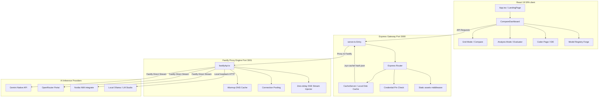

<div align="center">


# 🌌 NYX — Premium Multi-Model Arena & Coder Playground

[](https://vite.dev)
[](https://react.dev)
[](https://fastify.dev)
[](https://tailwindcss.com)

**NYX** is a state-of-the-art, high-fidelity developer playground designed for side-by-side LLM comparison, advanced code generation, and direct proxy routing with unified caching. Designed around a "clinical-modern" user interface, it provides millisecond-level responsive streaming, modular IDE controls, deep comparison metrics, and robust API keys credential handling.

</div>

---

## 🛠️ System Architecture

NYX uses a highly optimized dual-server architecture that leverages the modularity of **Express** alongside the extreme streaming throughput of **Fastify**. This ensures zero-overhead EventSource (SSE) flushing, persistent TCP connection keep-alives, and automatic fallback capabilities.



---

## ✨ Core Pillars & Features

### 1. 🤼 Side-by-Side Model Arena
- Compare outputs of two distinct models concurrently in a high-fidelity visual grid.
- Synchronized prompt submission with customized model configurations.
- Real-time token streaming with syntax-highlighted code blocks, copy utilities, and status tracking.

### 2. ⚡ Streaming Optimization Engine (Fastify & Express)
- **Fastify Router Bridging**: SSE streams bypass Express compression bottlenecks, utilizing Fastify's zero-copy write loops for instant data flushing.
- **Nagle's Algorithm Disabling**: TCP sockets are initialized with `setNoDelay(true)`, eliminating the 40ms network buffering delay.
- **DNS Lookup Warmup**: Background lookups to Cloudflare DNS (`1.1.1.1` and `8.8.8.8`) bypass Windows local host resolver latency.
- **Connection Keep-Alives**: Persistent sockets stay active for 75 seconds, eliminating HTTPS handshakes on consecutive prompts.

### 3. 💾 Ultra-Fast Local Disk Caching
- Key generation compiles the request structure (provider, model, prompt, system prompt, conversation history, settings) into a unique **SHA-256 hash**.
- High-efficiency disk cache residing under the `.nyx-cache/` directory.
- Features complete stats tracking (hits, misses, storage size, itemized logs) and single-click flushing.

### 4. 🎛️ Model Registry & Forge
- Clean, searchable model registry dashboard displaying capabilities, cost ratios, and latency status.
- Support for **Local Models** via automatic host loopback discovery (Ollama and LM Studio).
- Instant switching, column scaling, and state persistence.

### 5. 💻 Coder Mode IDE Workspace
- Full-screen coder interface supporting multiline editor windows, contextual prompts, and variable LLM settings.
- Structured code execution and live session-level audits.

### 6. 🔐 Credential PIN Locker
- Secure front-end storage of custom provider API keys inside `localStorage`.
- Master locking layer with customized PIN codes, auto-lock timeouts, and memory clearance.

---

## 📂 Codebase Directory Structure

```yaml
NYX/
├── .agents/                 # Automated agents, configurations, and scripts
├── .nyx-cache/              # Local SHA-256 disk cache directory
├── server/                  # Backend Node.js source files
│   ├── lib/
│   │   ├── apiAgent.ts      # Global connection pooling configurations
│   │   ├── cache.ts         # High-efficiency prompt caching mechanism
│   │   ├── fastifyApi.ts    # Fastify stream assembler & DNS warmup engine
│   │   └── gateway.ts       # Route proxy controllers
│   └── routes/              # Specialized API router files (Gemini, Nvidia, OpenRouter, Ollama)
├── src/                     # React 19 SPA source files
│   ├── components/          # Reusable presentation and layout components
│   │   ├── dashboard/       # AnalysisView, Sidebar, ModelRegistryView, SettingsView, HistoryView
│   │   ├── landing/         # AppPreview, LiveTerminal, WebGLShader
│   │   ├── model-card/      # Side-by-side output display panels
│   │   ├── ui/              # Atom-level layout buttons, tooltips, and icons
│   │   └── LandingPage.tsx  # Clinical-modern welcome hub & animation sequence
│   ├── config/              # Model listings, system configurations, agent catalogs
│   ├── context/             # Global contexts (e.g. ThemeContext)
│   ├── features/            # Coder features & related IDE view blocks
│   ├── hooks/               # Core state machinery hooks (useDashboardState, etc.)
│   ├── lib/                 # State sync helpers, stream parsers, client tools
│   ├── types/               # Type files for model, grid, column structure
│   ├── App.tsx              # Root React element with authentication gateway
│   ├── index.css            # Base visual system tokens (light/dark modes)
│   └── main.tsx             # DOM entry point
├── server.ts                # Application entry point (dual Express & Fastify assembler)
├── vite.config.ts           # Bundler config & Tailwind vite configurations
└── tsconfig.json            # Strict TypeScript settings
```

---

## 🚦 Getting Started & Local Setup

### Prerequisites
- **Node.js** v18 or newer
- **Local AI Engines** (Optional): Ollama or LM Studio running locally

### Installation & Launch

1. **Clone the repository and install packages**:
   ```bash
   npm install
   ```

2. **Setup Local API Keys**:
   Create a `.env.local` or copy values into the client dashboard's Settings tab:
   ```env
   GEMINI_API_KEY=your_gemini_api_key_here
   OPENROUTER_API_KEY=your_openrouter_api_key_here
   NVIDIA_API_KEY=your_nvidia_api_key_here
   ```

3. **Spin up the Dual Server**:
   ```bash
   npm run dev
   ```
   This runs `tsx watch server.ts` which fires up the Express Gateway on port `3000` and Fastify engine on port `3001`.

4. **Access the Playground**:
   Navigate to [http://localhost:3000](http://localhost:3000) on your web browser to enter the NYX Arena!

---

## 💎 Design System & Aesthetic Tokens

NYX uses a design system tailored around **clinical-modern** visuals. Details are defined within `DESIGN.md`. Key design properties:
- **Cream Light Theme**: Dominant premium warm background (`#FCF9F2`), deep geometric gray fonts (`#1D1D1F`), and clean card surfaces (`#FFFFFF`).
- **Clinical Dark Theme**: Elevated charcoal backdrop (`#3A3A3C`), sharp cards (`#48484A`), and ultra-legible headers (`#FFFFFF`).
- **Signature Apple Accents**: Primary interactive highlights powered by Apple System Blue (`#0071E3` light / `#0A84FF` dark).
- **Subtle Spring Easing**: Framer-motion interactive components utilize spring easings for highly tactile UI responses.

---

<div align="center">
Created with 🌌 by the NYX Development Team.
</div>
